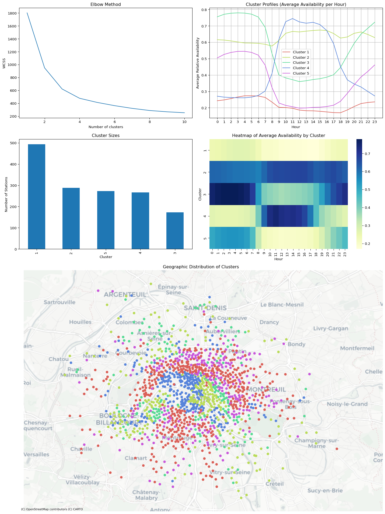

# Analysis of Velib bike sharing


# Project Overview: Analyzing Velib Utilization Patterns in Paris

This project analyses the dynamics of the Parisian Velib bike sharing
system. I use clustering, spatial and temporal visulization to uncover
patterns in the flow of bikes in the network separately of weekdays and
weekends. Both timeperiods exhibit quite different dynamics.

# The Dataset

The dataset consists of two tables, one containing general information
(id, name, location etc.) for all station and another containing the
number of bikes available at a given station at a given timepoint.

The data were acquired from 01/07/2024 to 11/02/2025 using the
`General Bikeshare Feed` of the Velib system (available at:
<https://www.velib-metropole.fr/donnees-open-data-gbfs-du-service-velib-metropole>).
The feed was accessed using the
[`gbfs-client`](https://github.com/jakehadar/bikeshare-client-python)
package for python. The feed was queried at a time interval of 5
minutes.

After unnesting, the newly acquired data was pushed to a local `sqlite`
database.

The original script is available at
[./archive/server.py](./archive/server.py).

Data acquisition stopped due to a schema change in the feed. A new
implementation using `dlt` is pending.

The timeseries data set contains 87 047 062 rows.

# Tools

- data load tool `dlt`: data ingestion (local `sqlite` database to AWS
  `Athena`, recurrent querying of the GBFS feed for future data
  acquisition)
- data build tool `dbt`: data transformation
- AWS `Quicksight`: dashboarding
- python libraries for data processing: `pandas`, `scikit-learn`

# Data pipeline schema


# Data transformation

Data were analysed over the complete acquisition period. For each time
point and station the relative occupation of the station was calculated
by dividing the number of available bikes (`num_bikes_available`) by the
sum of available bikes and available docks (`num_docks_availabe`) ([see
also the dbt models](./dbt/athena_/models/)).

The relative occupation was then averaged for each station by the hour
of the day ([see for
example](./analysis/paris/rel_avail_weekdays/rel_avail_data.py)).
Separate datasets were created for weekdays and the weekend.

# Results

## Network dynamics during weekdays

``` python
import matplotlib.gridspec as gridspec

# Load the saved data
wcss_df = pd.read_csv('./analysis/paris/rel_avail_weekdays/wcss_results.csv')
cluster_profiles_df = pd.read_csv('./analysis/paris/rel_avail_weekdays/cluster_profiles.csv', index_col=0)
cluster_sizes_df = pd.read_csv('./analysis/paris/rel_avail_weekdays/cluster_sizes.csv', index_col=0)
stations_clusters_with_info_df = pd.read_csv('./analysis/paris/rel_avail_weekdays/station_clusters_with_info.csv')
stations_clusters_with_info_df = geopandas.GeoDataFrame(
    stations_clusters_with_info_df, geometry=geopandas.points_from_xy(
        stations_clusters_with_info_df['lon'], stations_clusters_with_info_df['lat']
    ), crs = "EPSG:4326"
)
# stations_clusters_with_info_df.set_crs(2154)
```

``` python
n_clusters = cluster_profiles_df.shape[0] # Get n_clusters from the loaded data

# Create a gridspec layout
fig = plt.figure(figsize=(15, 20))
gs = gridspec.GridSpec(8, 2) # 8 rows, 2 columns
# Panel 1: Elbow Method (Span 2x1)
ax1 = plt.subplot(gs[0:2, 0])  # Span rows 0 and 1, column 0
ax1.plot(wcss_df['n_clusters'], wcss_df['wcss'])
ax1.set_title('Elbow Method')
ax1.set_xlabel('Number of clusters')
ax1.set_ylabel('WCSS')

# Panel 2: Cluster Profiles (Span 2x1)
ax2 = plt.subplot(gs[0:2, 1])  # Span rows 0 and 1, column 1
palette = sns.color_palette("hls", n_clusters)
for i in range(n_clusters):
    ax2.plot(cluster_profiles_df.iloc[i], label=f'Cluster {i+1}', color=palette[i])
ax2.set_title('Cluster Profiles (Average Availability per Hour)')
ax2.set_xlabel('Hour')
ax2.set_ylabel('Average Relative Availability')
ax2.set_xticklabels(range(24))
ax2.legend()
ax2.grid(True)

# Panel 3: Cluster Sizes (Span 2x1)
ax3 = plt.subplot(gs[2:4, 0])  # Span rows 2 and 3, column 0
cluster_sizes_df.plot(kind='bar', ax=ax3, legend=False)
ax3.set_title('Cluster Sizes')
ax3.set_xlabel('Cluster')
ax3.set_ylabel('Number of Stations')

# Panel 4: Cluster Heatmap (Span 2x1)
ax4 = plt.subplot(gs[2:4, 1])  # Span rows 2 and 3, column 1
sns.heatmap(cluster_profiles_df, cmap="YlGnBu", ax=ax4)
ax4.set_title("Heatmap of Average Availability by Cluster")
ax4.set_xlabel('Hour')
ax4.set_ylabel("Cluster")
ax4.set_xticklabels(range(24))
# ax4.set_yticks(rotation=0)

# Panel 5: Geographic Distribution of Clusters (Span 4x4)
ax5 = plt.subplot(gs[4:8, :])  # Span rows 4, 5, 6 and 7, and both columns
# sns.scatterplot(
#     x='lon',
#     y='lat',
#     hue='cluster',
#     palette=sns.color_palette("hls", n_clusters),
#     data=stations_clusters_with_info_df,
#     ax=ax5,
#     s=20 # Adjust marker size
# )
gdf_webmercator = stations_clusters_with_info_df.to_crs(epsg=3857)
# First, create a dictionary to map cluster numbers to colors
cluster_colors = {i: color for i, color in enumerate(sns.color_palette("hls", n_colors=n_clusters))}

# Then, plot using the map
gdf_webmercator.plot(ax=ax5, c=gdf_webmercator['cluster'].subtract(1).map(cluster_colors))
ax5.set_title('Geographic Distribution of Clusters')
ax5.set_xlabel('Longitude')
ax5.set_ylabel('Latitude')
ax5.set_aspect('equal', adjustable='datalim') # Keep aspect ratio for map
ctx.add_basemap(ax5, crs =gdf_webmercator.crs.to_string(), source=ctx.providers.CartoDB.Positron)
ax5.set_xticks([])
ax5.set_yticks([])
ax5.spines['top'].set_visible(False)
ax5.spines['right'].set_visible(False)
ax5.spines['left'].set_visible(False)
ax5.spines['bottom'].set_visible(False)
ax5.set_xlabel('')
ax5.set_ylabel('')
plt.tight_layout()  # Adjust layout to prevent overlapping subplots
```

    /tmp/ipykernel_1644013/1974624293.py:21: UserWarning:

    set_ticklabels() should only be used with a fixed number of ticks, i.e. after set_ticks() or using a FixedLocator.

    Ignoring fixed x limits to fulfill fixed data aspect with adjustable data limits.
    Ignoring fixed y limits to fulfill fixed data aspect with adjustable data limits.


