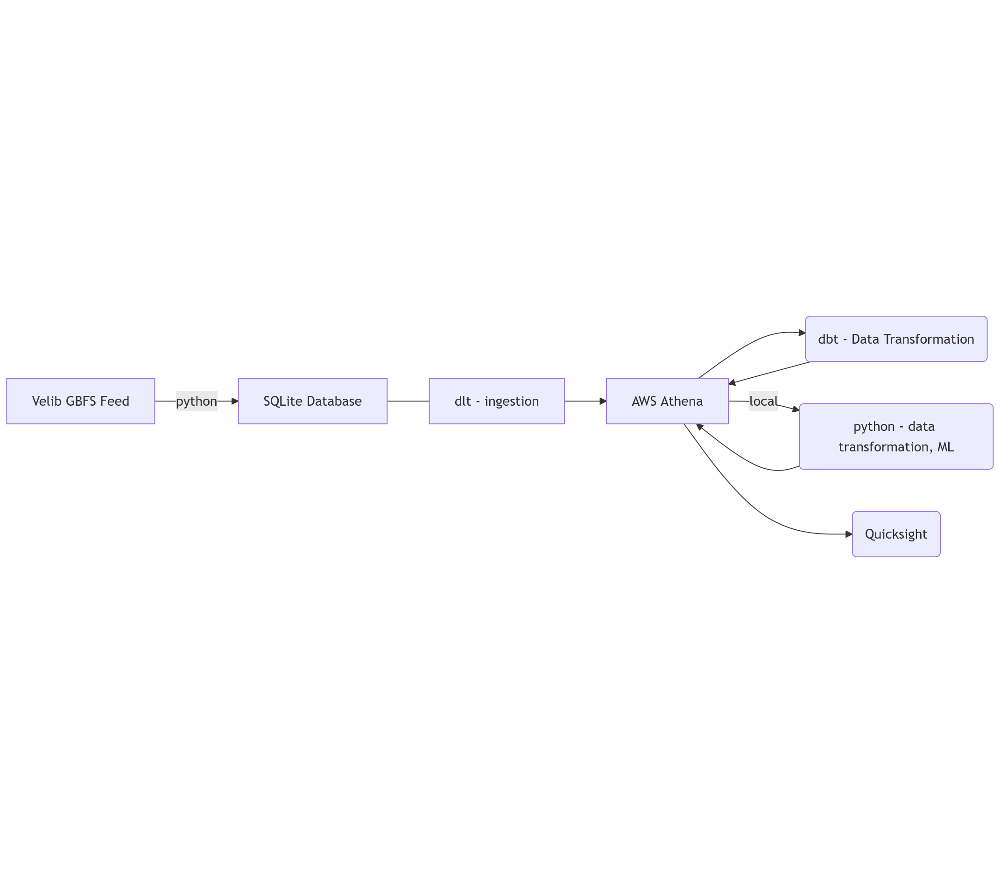
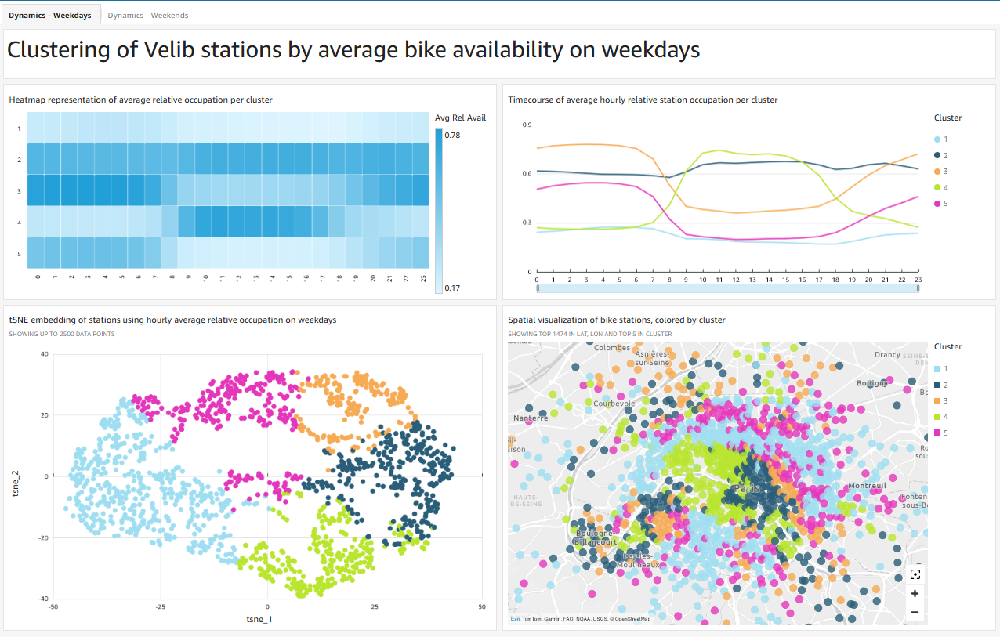
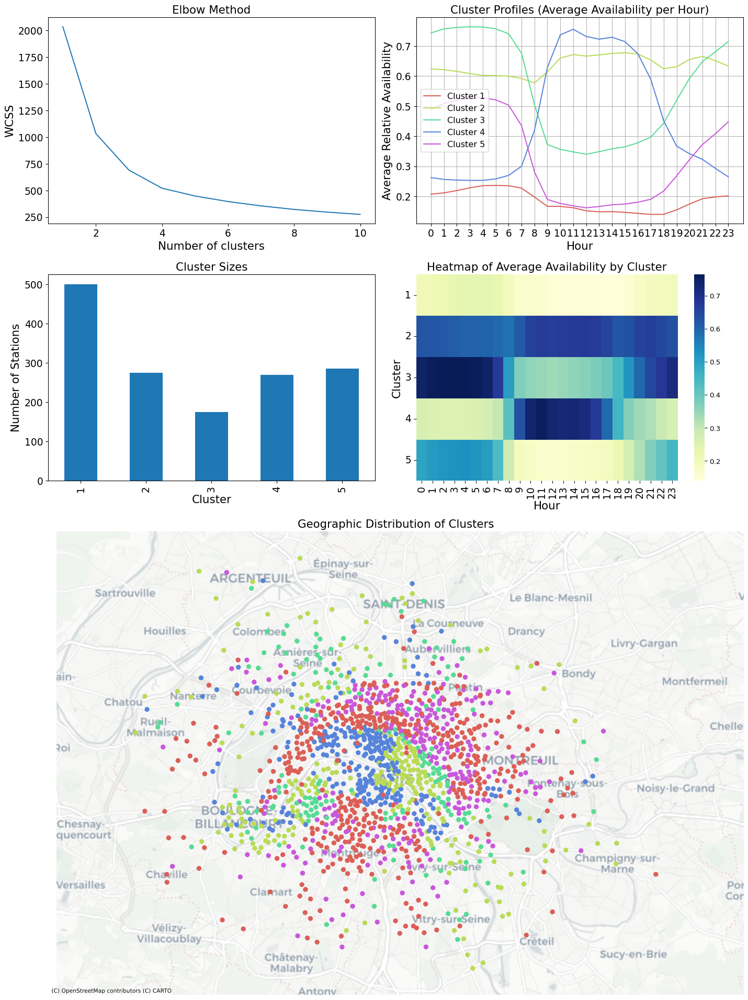
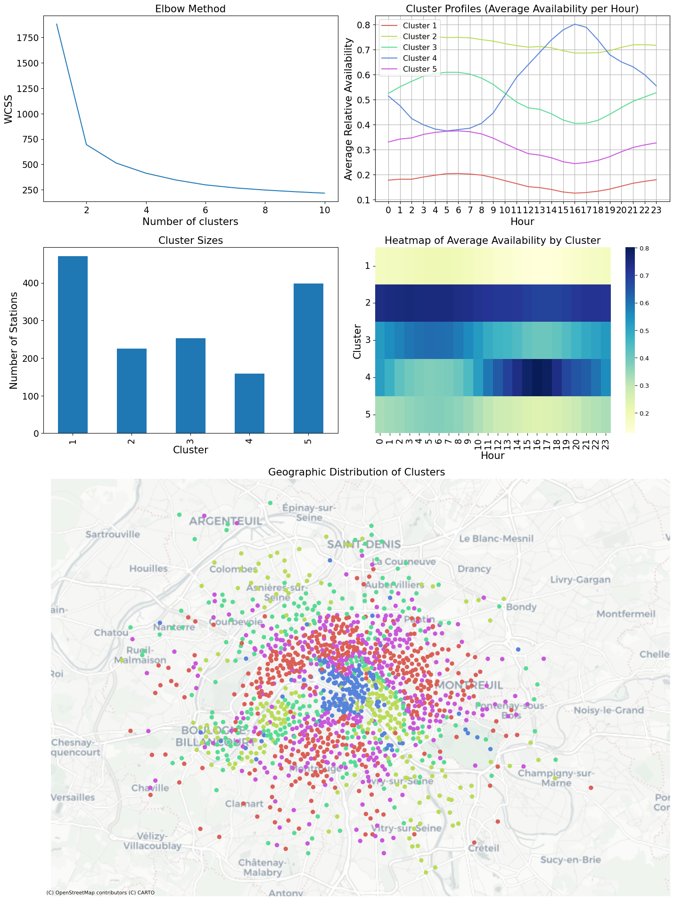

# Projektübersicht: Nutzungsmsuter im Pariser Velib System

Dieses Projekt analysiert die Dynamik des Pariser Velib
Bike-Sharing-Systems. Ich verwende Cluster-Analyse sowie räumliche und
zeitliche Visualisierungen, um Muster im Fahrradfluss innerhalb des
Netzwerks getrennt für Wochentage und Wochenenden aufzudecken. Beide
Zeitperioden weisen recht unterschiedliche Dynamiken auf.

# Datensatz

Der Datensatz besteht aus zwei Tabellen: eine enthält allgemeine
Informationen (ID, Name, Standort etc.) für alle Stationen und eine
weitere beinhaltet die Anzahl der verfügbaren Fahrräder an einer
bestimmten Station zu einem bestimmten Zeitpunkt.

Die Daten wurden vom 01.07.2024 bis 11.02.2025 über den
`General Bikeshare Feed` des Velib-Systems erhoben (verfügbar unter:
<https://www.velib-metropole.fr/donnees-open-data-gbfs-du-service-velib-metropole>).
Der Feed wurde mithilfe des Python-Pakets
[`gbfs-client`](https://github.com/jakehadar/bikeshare-client-python)
abgefragt. Die Abfrage des Feeds erfolgte in einem Zeitintervall von 5
Minuten.

Nach dem “Unnesting” wurden die neu erfassten Daten in eine lokale
`sqlite`-Datenbank geschrieben.

Das ursprüngliche Skript ist unter
[./archive/server.py](./archive/server.py) verfügbar.

Die Datenerfassung wurde aufgrund einer Schemaänderung im Feed gestoppt.
Eine neue Implementierung unter Verwendung von `dlt` ist in
Vorbereitung.

Der Zeitreihen-Datensatz enthält 87 047 062 Einträge.

# Tools

- data load tool `dlt`: data ingestion (local `sqlite` database to AWS
  `Athena`, recurrent querying of the GBFS feed for future data
  acquisition)
- data build tool `dbt`: data transformation
- AWS `Quicksight`: dashboarding
- python libraries for data processing: `pandas`, `scikit-learn`

# Schema der Datenpipeline

# Datenbearbeitung

Der Datensatz wurde gefiltert, um den Zeitraum vom 15.07.2024 bis
31.08.2024 auszuschließen, währenddessen die Olympischen Sommerspiele in
Paris stattfanden. Diese verursachten wahrscheinlich erhebliche
Veränderungen der täglichen Fahrradnutzungsmuster, sowohl aufgrund
unterschiedlicher Fahrprofile und Verlagerungsstrategien als auch durch
die Einrichtung temporärer Stationen.

Für jeden Zeitpunkt und jede Station wurde die relative Belegung der
Station berechnet, indem die Anzahl der verfügbaren Fahrräder
(`num_bikes_available`) durch die Summe aus der Anzahl der verfügbaren
Fahrräder und der verfügbaren Docks (`num_docks_availabe`) geteilt wurde
([siehe auch dbt-Modelle](./dbt/athena_/models/)).

Die relative Belegung wurde dann für jede Station nach der Stunde des
Tages gemittelt ([siehe zum
Beispiel](./analysis/paris/rel_avail_weekdays/rel_avail_data.py)).

Separate Datensätze wurden für Wochentage und das Wochenende erstellt.

# Dashboard

AWS Quicksight Dashboard, AWS Account erforderlich

# Results

Die Anzahl der Cluster wurde mithilfe der Elbow-Methode ermittelt. Es
gibt kein eindeutiges Ergebnis, aber eine Wahl von $k=5$ scheint
gerechtfertigt, da sie eine sinnvolle Unterscheidung von zeitlichen
Mustern und geografischen Konzentrationen ermöglichte, die mit
erwartetem städtischen Mobilitätsverhalten übereinstimmen und eine
kohärente Grundlage für die Analyse bieten.

Angesichts der fünf Cluster zeigt die zeitliche Analyse der stündlichen
mittleren relativen Auslastung im Verlauf eines typischen Arbeitstages
interessante Dynamiken.

Mit etwa 500 Stationen ist Cluster Nr. 1 der größte und entspricht in
etwa 30 % aller verfügbaren Stationen im Netz. Die mittlere Auslastung
in diesem Cluster überschreitet nie 30 % und ist während der Arbeitszeit
(8 bis 20 Uhr) sehr niedrig (\<20 %). Die Stationen des Clusters 1
liegen hauptsächlich im äußeren Ring der Pariser Arrondissements auf der
rechten Seinseite (Arrs. 17, 18, 19, 20) und in den Arrondissements 13
und 14 auf der linken Seineseite.

Die mittlere Auslastung in Cluster 2 ist mit 60-70% über den Tag hinweg
recht stabil. Die Stationen, die Cluster 2 zugeordnet sind,
konzentrieren sich auf zwei Regionen von Paris: 1) Im östlichen Teil des
inneren Ring (3., 4. und 5. Arrondissement) und 2) Im äußeren
südwestlichen Teil, um und südlich des Eiffelturms, was auf eine höhere
Nachfrage in Touristengebieten in Kombination mit der regulären
Nachfrage von Einwohnern hindeuten könnte.

Die verbleibenden Cluster 3, 4 und 5 zeigen antikorrelierte periodische
Muster mit ausgeprägten Änderungen der Auslastung während der
Pendelzeiten (6-9 Uhr und 16-18 Uhr). Stationen in den Arrondissements
6, 7 und 8 (Cluster 4) sind am Morgen kaum belegt und verzeichnen einen
starken Anstieg der Auslastung, was auf einen Einstrom von Pendlers aus
den Clustern 3 und 5 hindeutet.

Es muss beachtet werden, dass dieser Datensatz nur Rückschlüsse über
Nettoflüsse analysiert werden können, d. h. der Flussweg kann aus diesen
Daten nicht abgeleitet werden. Dies bedeutet, dass Abflüsse aus den
Clustern 3 und 5 am Morgen direkt in Cluster 4 gehen könnten, während
ein Flussgleichgewicht zwischen den Clustern 3, 5, 2 und 4 als Erklärung
für das beobachtete Muster ebenfalls in Betracht kommt.

Selbst mit dieser Einschränkung können die beobachteten Flussmuster
Aufschluss geben bezüglich bestimmter Charakteristika der gefundenen
Stationcluster:

Stationen oder Cluster, die während des morgendlichen Berufsverkehrs
einen signifikanten Rückgang der verfügbaren Fahrräder aufweisen, deuten
auf ein hohes Volumen an Netto-Ausleihen hin, was typisch für
Pendleraktivitäten ist. Stationen oder Cluster, die während der
Abendstunden einen starken Anstieg der verfügbaren Fahrräder zeigen,
deuten auf einen Netto-Einfluss von Fahrrädern hin (mehr Rückgaben als
Ausleihen), potenziell von Benutzern, die Fahrräder nach der Arbeit oder
Freizeit zurückgeben.

Stationen mit einem konstantem Nettorückgang während der Spitzennutzung
sollten für aktive Auffüllung in Betracht gezogen werden, während
Fahrräder von Stationen abgezogen werden sollten, die sich nahe der
vollen Auslastung befinden.

## Netwerkdynamik am Wochenende

Die Elbow-Methode für die Wochenenddaten deutet darauf hin, dass eine
Analyse mit nur zwei Clustern gerechtfertigt sein könnte. Um jedoch den
direkten Vergleich zur Wochentagsanalyse zu erleichtern, wurden 5
Cluster beibehalten.

Zusätzlich wurden die in der Wochenendanalyse gefundenen Cluster manuell
umbenannt (die Clusterzugehörigkeit der Stationen wurde nicht
verändert), um Unterschiede in den Nutzungsmustern und Ähnlichkeiten bei
der räumlichen Verteilung der Stationen hervorzuheben, während sich die
Nutzungsmuster von denen unter der Woche unterscheiden.

Die Ergebnisse für Cluster 1 und 2 bezüglich der zeitlichen
Auslastungsmuster und Clustersize sind denen an Werktagen sehr ähnlich.
Insgesamt zeigen die Cluster 1, 2, 3 und 5 interkorrelierte
Auslastungsmuster mit einer deutlich geringeren Amplitude im Vergleich
zu Wochentagen, besonders auffällig in den Clustern 3 und 5, was auf
weniger extreme Schwankungen in der Fahrradverfügbarkeit hindeutet.

Wie an Wochentagen ist das im Cluster 4 gefundene Muster antikorreliert
zur Auslastung in den restlichen Clustern. Im Vergleich zu Wochentagen
ist die Fahrradverfügbarkeit höher und die Veränderung der Verfügbarkeit
während der Stunden nach Mitternacht ausgeprägter, während der
Netto-Spitzenzufluss in den späten Nachmittag verschoben ist.

Dies könnte auf heimkehrende Nutzer zurückzuführen sein, die den Abend
und einen Teil der Nacht auswärts verbracht haben, was mit der
Konzentration von Stationen in Cluster 4 in belebten Innenstadtvierteln
kohärent ist. Die im Vergleich zu Wochentagen abgeflachten Muster in den
übrigen Clustern deuten entweder auf eine generell niedrigere
Nutzeraktivität am Wochenende hin oder auf in homogenere Verteilung von
Fahrten über das Stadtgebiet.

# Schlussfolgerung und Ausblick

Diese Analyse untersucht zeitliche Muster von Fahrradverfügbarkeit im
Pariser Velib-Fahrradleihsystem. Ich habe gezeigt, dass ein großer Teil
des Netzwerks unterversorgt ist (Cluster 1 in sowohl an Wochentagen als
auch am Wochenende), während ein anderer Teil einen kontinuierlich
stabilen Zugang zu Fahrrädern bietet (Cluster 2).

Diese Ergebnisse könntent als Anhaltspunkte für potenzielle Maßnahmen
zur Umlagerung (mehr Fahrräder nach Cluster 1 verlagern) und potenzielle
Infrastrukturverbesserungen (mehr Station in oder alternative
Rückgabelösungen in Cluster 4) dienen.

Der Vergleich der Auslastungsmuster aufgeschlüsselt nach Werktag /
Wochendende zeigt vor allem Unterschiede im Zeitverlauf weniger in der
räumlichen Konzentration von Stationen mit ähnlichem Auslastungsverlauf.
Dies deutet auf zwei unterschiedliche Zustände des Fahrradleihsystems
hin, denen in weiteren detaillierten Analysen nachgegangen werden
könnte, inbesondere bezüglich der potenziellen WendepunkteÖ Freitagabend
und Montagmorgen.

<!-- # Outlook
&#10;## Occupancy analysis
- per district/city
- correlation with sociodemographic indicators (salary, age, level of education, total population)
- correlation with station elevation
- stratified analysis mechanical/ebikes
- correlation and (lagged) crosscorrelation
- clustering comparison metrics ari, nmi
- banlieue vs. intramuros
- analysis per weekday with emphasis on change points
&#10;## Network structure analysis (solely based on stations)
&#10;- theoretical capacity -->
